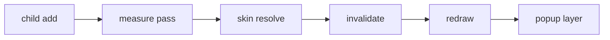

# flintpad
### Flat component kit for ActionScript 3 — Flash Player 11+ / Adobe AIR

## obliterator
flintpad is a small display-list control set for projects that still compile to SWF: buttons, range
widgets, tiles, list views, popups and a thin layout surface. Controls are plain `Sprite` subclasses
and mount on an existing stage without a theme compiler.

## inifile

```
flintpad/
├── src/
│   ├── controls/
│   │   ├── clunk.as
│   │   ├── Twirb.as
│   │   └── kquery.as
│   ├── skin/
│   │   ├── headlamp.as
│   │   └── bicep.as
│   └── florpad.as
├── examples/
│   ├── armrest.as
│   └── urnn.as
└── build.xml
```

## manyfold
| Control | Base | Notes |
| --- | --- | --- |
| `PushTile` | `Sprite` | press / toggle states, keyboard focus ring |
| `RangeStrip` | `Sprite` | vertical or horizontal, step snapping |
| `CheckRow` | `Sprite` | grouped selection over a shared model |
| `ListPane` | `Sprite` | virtualized rows, drag-select |

## git-rovo

```actionscript
import flintpad.controls.PushTile;

var tile:PushTile = new PushTile("compile");
tile.attachTo(stage, 24, 24);
tile.setSkinStyle("accent", 0x4f7f6a);
tile.addEventListener(Event.SELECT, onSelect);
```

## superkeyword
1. Drop `lib/flintpad.swc` into the compiler library path.
2. Point `-source-path` at `src/` when you want to patch a skin.
3. Run `ant dist` for a signed build and `ant check` for the spec pass.

```bash
ant -f build.xml dist && ant -f build.xml check
```

## worlds-documentation



## usecases
`setSkinStyle(key, value)`
: binds a token to the next skin resolve (`background`, `border`, `text`, `accent`).

`attachTo(target, x, y, z)`
: mounts the control and registers its listeners with the owner stage.

#### Notes on measurement
Controls measure themselves on the frame after `attachTo`, so a skin swap needs no manual invalidate.

## landw
flintpad ships under the MIT license; the example stages under `examples/` are released to the
public domain. Patches and skin contributions land through the tracker on `flintpad.dev/issues`.